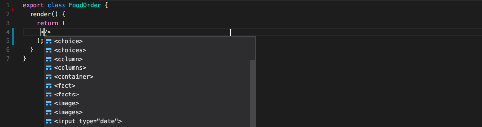
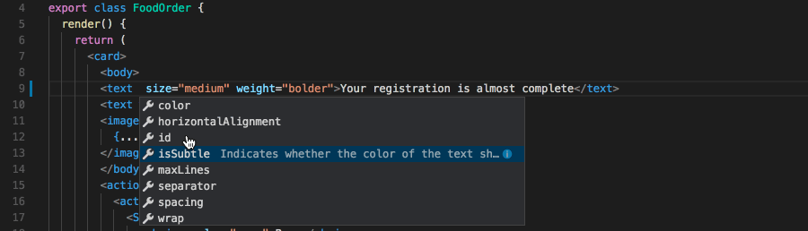
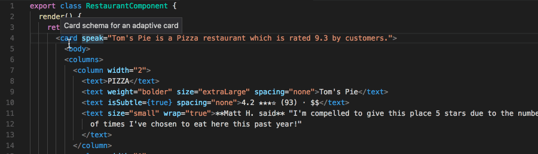
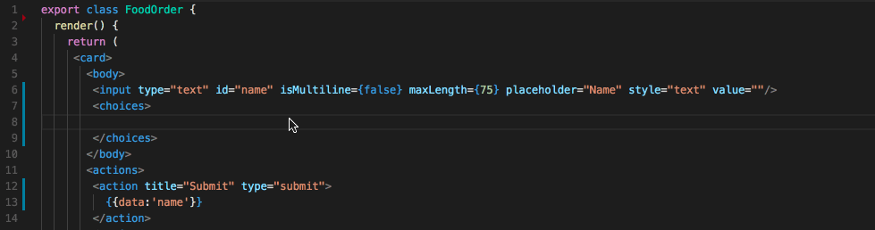

# Adaptive Cards JSX Support for Visual Studio Code 
A [Visual Studio Code](https://code.visualstudio.com/) [extension](https://marketplace.visualstudio.com/VSCode)
for the [Adaptive Cards](http://adaptivecards.io/) [JSX syntax](https://github.com/justinwilaby/babel-plugin-jsx-adaptive-cards)
including features like auto-complete, validation and error checking, intellisense and hover detail. 

# Features 

## Code completion
The entire Adaptive Card schema has been *adapted* to use JSX syntax for authoring cards. These JSX elements are provided
as code completion snippets

### Attribute code completion 

## Hover
Get the details of an element by hovering over the tag name, attribute name or attribute values

## Schema Validation
Get notifications of errors as they occur so your Adaptive Card is always valid.

# Roadmap
- Formatting - Document formatting and cleanup 
- Auto-complete and auto import of Components
- Better error notifications for invalid markup

# Contributors Needed!
I will be welcoming pull requests for bug fixes, features and unit tests. Feel free to dive in!
